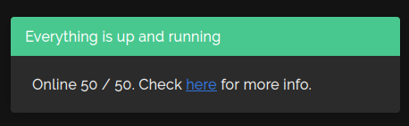

# Uptime Kuma for Homer

Uptime Kuma for Homer is a tool that will help you quickly preview the status of [Uptime Kuma](https://github.com/louislam/uptime-kuma) monitors in the message part of your [Homer](https://github.com/bastienwirtz/homer) instance.

<p align="center">
  
</p>

## How It Works

1. Uptime Kuma exposes Prometheus metrics with the up-to-date status of all the monitors, websites or services that you track with it.
2. You run Uptime Kuma for Homer, or this project, and it parses that date to prepare it for Homer dashboard.
3. Homer dashboard supports a message at the top of all pages that can fetch information from a webiste, or Uptime Kuma for Homer in this case.
4. Whenever you open your Homer dashboard, you will be able to quickly glance the status of all your monitors in Uptime Kuma, and quickly reach it.

## Usage

### Docker container

The easiest and the recommended way is to run it as a Docker container.

1. Have this repo cloned.

2. Build the container:

    ```sh
    docker build -t uptimekuma_homer:latest .
    ```

3. (Optional) Release the container to your Docker registry, if you are using it:

    ```sh
    docker tag uptimekuma_homer:latest docker-registry.local:5000/uptimekuma_homer:latest
    docker push docker-registry.local:5000/uptimekuma_homer:latest
    ```

4. Provide configuration using environment variables. Following variables have to be available:

    `UKH_PORT`: a port where Uptime Kuma for Homer will listen, use `8099` for default.
    
    `UKH_HOST`: URL, a link, to your Uptime Kuma instance.
    
    `UKH_API_KEY`: in order to fetch Uptime Kuma metrics we need to authenticate. Go to your Uptime Kuma instance, then Settings and finally API Keys option. Click on _Add API Key_ and use the generated key here.

5. You can use provided `compose.yml` in case you are using Docker Compose, Portainer, or similar orchestration tool. Or simply run the container yourself:

    ```sh
    docker run -d --restart=always    \
        -p ${UKH_PORT}:${UKH_PORT}    \
        -e UKH_PORT=${UKH_PORT}       \
        -e UKH_HOST=${UKH_HOST}       \
        -e UKH_API_KEY=${UKH_API_KEY} \
        -t uptimekuma_homer:latest
    ```

6. Go to _Homer configuration_ section of this document to set up your Homer dashboard instance.

### Standalone

Since Uptime Kuma for Homer is a simple Python application, using Flask framework, you can run it directly too.

1. Have this repo cloned.

2. Uptime Kuma for Homer uses these Python libraries: `Flask`, `Flask-Cors`, `requests` and `prometheus_client`. You can install them using your operating system packages, or more simply via Python's virtual environment. So let's do the latter:

    ```sh
    python -m venv .venv
    source .venv/bin/activate
    pip install -r requirements.pinned.txt
    ```
    
3. Now you are ready to run the application:

    ```sh
    python main.py
    ```

4. (Optional) set up WSGI server if you want, but this is very simple application for internal use and you really shouldn't bother yourself with that.

### Homer configuration

Having Uptime Kuma for Homer successfully running somewhere where it can be reached from your Homer dashboard instance, setting up Homer is really simple. Just add the following to your Homer's `config.yml` file:

```yaml
message:
  url: "http://uptime-kuma-for-homer.local:8099/endpoint/"
  style: "is-danger"
  title: "Service status"
  content: "Waiting for results from Uptime Kuma for Homer..."
```

## Development

### Build and test

Building docker container:

```sh
docker build --progress=plain --no-cache -t uptimekuma_homer:latest .
```

Testing Uptime Kuma metrics endpoint:

```sh
curl -u":${UKH_API_KEY}" $UKH_HOST/metrics
```

Running development docker container:

```sh
docker run --rm -it               \
    -e UKH_PORT=${UKH_PORT}       \
    -e UKH_HOST=${UKH_HOST}       \
    -e UKH_API_KEY=${UKH_API_KEY} \
    -t uptimekuma_homer:latest
```

Releasing docker container to local registry for testing:

```sh
# Tag git repo and build container
git tag -a -m '1.0' 1.0
docker build -t uptimekuma_homer:1.0 .
# Tag container
docker tag uptimekuma_homer:1.0 docker-registry.local:5000/uptimekuma_homer:1.0
docker tag uptimekuma_homer:1.0 docker-registry.local:5000/uptimekuma_homer:latest
# Push container to the registry
docker push docker-registry.local:5000uptimekuma_homer:1.0
docker push docker-registry.local:5000/uptimekuma_homer:latest
```

